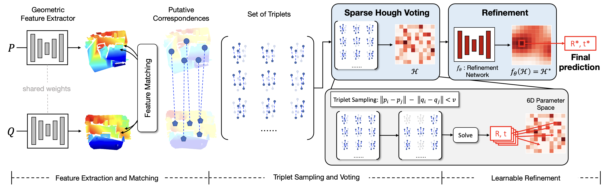
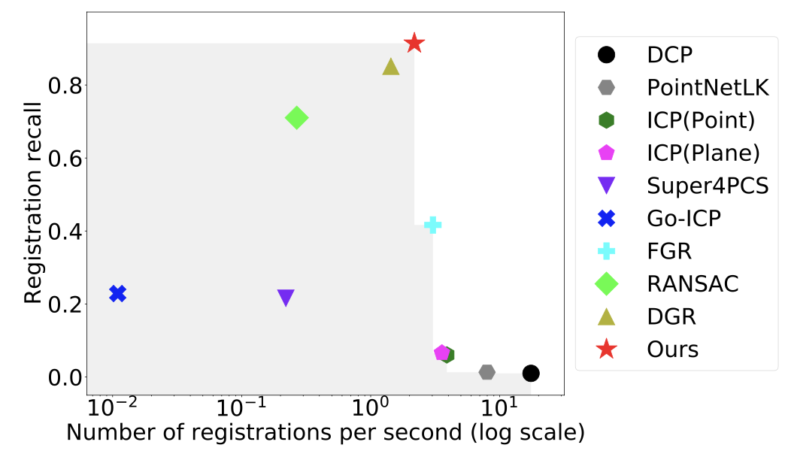
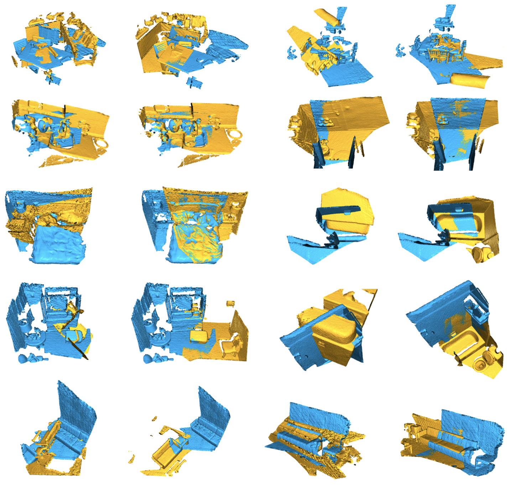

# Deep Hough Voting for Robust Global Registration, ICCV, 2021
### [Project Page](https://cvlab.postech.ac.kr/research/DHVR/) | [Paper](https://arxiv.org/abs/2109.04310) | [Video](https://youtu.be/lPv5kKQGxZQ)

[Deep Hough Voting for Robust Global Registration](https://cvlab.postech.ac.kr/research/DHVR/)  
 [Junha Lee](https://junha-l.github.io)<sup>1</sup>,
 Seungwook Kim<sup>1</sup>,
 [Minsu Cho](http://cvlab.postech.ac.kr/~mcho/)<sup>1</sup>,
 [Jaesik Park](http://jaesik.info/)<sup>1</sup><br>
 <sup>1</sup>POSTECH CSE & GSAI<br>
in ICCV 2021 

<div style="text-align:center">

</div>

### Overview

Point cloud registration is the task of estimating the rigid transformation that aligns a pair of point cloud fragments. We present an efficient and robust framework for pairwise registration of real-world 3D scans, leveraging Hough voting in the 6D transformation parameter space. First, deep geometric features are extracted from a point cloud pair to compute putative correspondences. We then construct a set of triplets of correspondences to cast votes on the 6D Hough space, representing the transformation parameters in sparse tensors. Next, a fully convolutional refinement module is applied to refine the noisy votes. Finally, we identify the consensus among the correspondences from the Hough space, which we use to predict our final transformation parameters. Our method outperforms state-of-the-art methods on 3DMatch and 3DLoMatch benchmarks while achieving comparable performance on KITTI odometry dataset. We further demonstrate the generalizability of our approach by setting a new state-of-the-art on ICL-NUIM dataset, where we integrate our module into a multi-way registration pipeline.

### Citing our paper

```
@InProceedings{lee2021deephough, 
    title={Deep Hough Voting for Robust Global Registration},
    author={Junha Lee and Seungwook Kim and Minsu Cho and Jaesik Park},
    booktitle={Proceedings of the IEEE/CVF International Conference on Computer Vision (ICCV)},
    year={2021}
}
```

### Experiments

|  Speed vs Accuracy | Qualitative results |
|:----------------------------:|:------------------:|
|    |  |

## Installation

This repository is developed and tested on 

- Ubuntu 18.04
- CUDA 11.1
- Python 3.8.11
- Pytorch 1.4.9
- MinkowskiEngine 0.5.4


### Environment Setup

Our pipeline is built on [MinkowskiEngine](https://github.com/NVIDIA/MinkowskiEngine).
You can install the MinkowskiEngine and the python requirements on your system with:

```
# setup requirements for MinkowksiEngine
conda create -n dhvr python=3.8
conda install pytorch=1.9.1 torchvision cudatoolkit=11.1 -c pytorch -c nvidia
conda install numpy
conda install openblas-devel -c anaconda

# install MinkowskiEngine
pip install -U git+https://github.com/NVIDIA/MinkowskiEngine -v --no-deps --install-option="--blas_include_dirs=${CONDA_PREFIX}/include" --install-option="--blas=openblas"

# download and setup DHVR
git clone https://github.com/junha-l/DHVR.git
cd DHVR
pip install -r requirements.txt
```

We also depends on [torch-batch-svd](https://github.com/KinglittleQ/torch-batch-svd), an open-source library for 100x faster (batched) svd on GPU.
You can follow the below instruction to install `torch-batch-svd`
```
# if your cuda installation directory is other than "/usr/local/cuda", you have to specify it.
(CUDA_HOME=PATH/TO/CUDA/ROOT) bash scripts/install_3rdparty.sh
```

## 3DMatch Dataset

#### Training

You can download preprocessed training dataset, which is provided by the author of [FCGF](https://github.com/chrischoy/FCGF), via these commands:
```
# download 3dmatch train set 
bash scripts/download_3dmatch.sh PATH/TO/3DMATCH
# create symlink
ln -s PATH/TO/3DMATCH ./dataset/3dmatch
```

#### Testing

The official 3DMatch test set is available at the [official website](https://3dmatch.cs.princeton.edu/).
You should download fragments data of Geometric Registration Benchmark and decompress them to a new folder.

Then, create a symlink via following command:
```
ln -s PATH/TO/3DMATCH_TEST ./dataset/3dmatch-test
```

## Train DHVR

The default feature extractor we used in our experiments is [FCGF](https://github.com/chrischoy/FCGF). You can download pretrained FCGF models via following commands:

```
bash scripts/download_weights.sh
```

Then, train with 
```
python train.py config/train_3dmatch.gin --run_name NAME_OF_EXPERIMENT
```

## Test DHVR

You can test DHVR via following commands:

#### 3DMatch
```
python test.py config/test_3dmatch.gin --run_name EXP_NAME --load_path PATH/TO/CHECKPOINT
```

#### 3DLoMatch
```
python test.py config/test_3dlomatch.gin --run_name EXP_NAME --load_path PATH/TO/CHECKPOINT
```

### Pretrained Weights
We also provide pretrained weights on 3DMatch dataset. You can download the checkpoint in following [link](https://drive.google.com/file/d/1f9EKcCCTCs5KJrEccmB08P6a-N-6NnlC/view?usp=sharing).

## Acknowledments

Our code is based on the [MinkowskiEngine](https://github.com/NVIDIA/MinkowskiEngine). We also refer to [FCGF](https://github.com/chrischoy/FCGF), [DGR](https://github.com/chrischoy/DeepGlobalRegistration), and [torch-batch-svd](https://github.com/KinglittleQ/torch-batch-svd).
